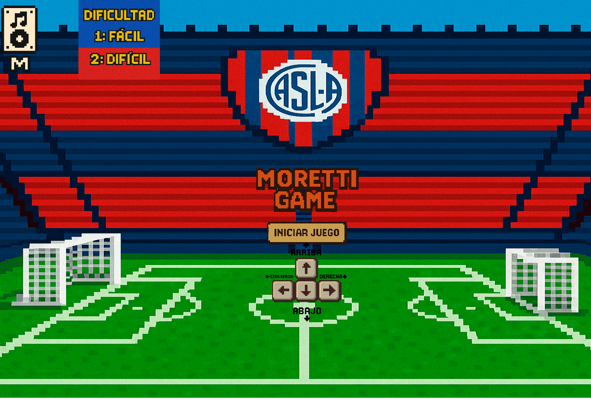
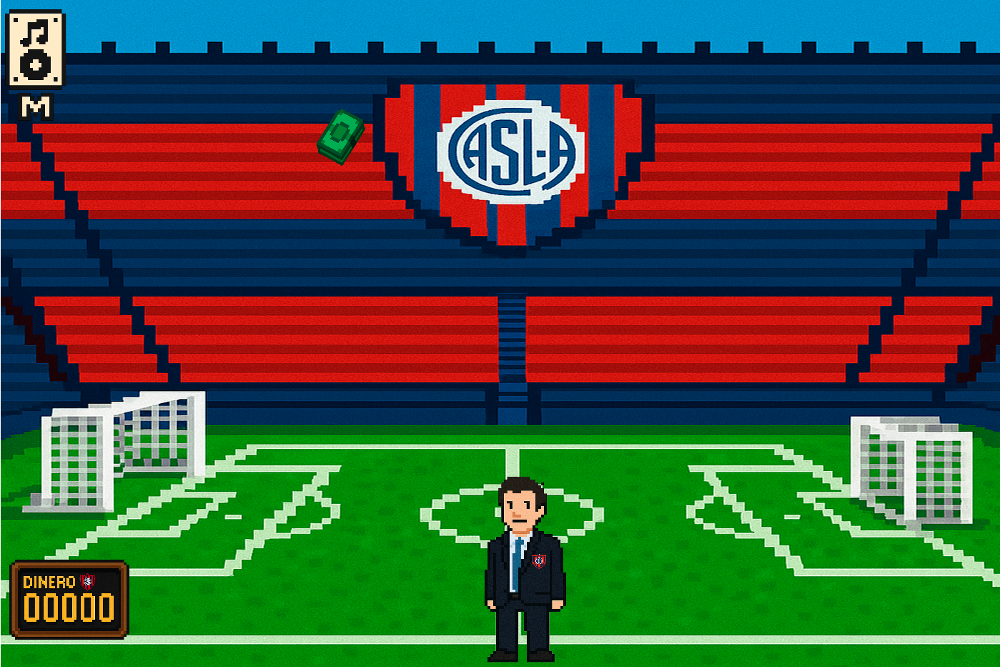
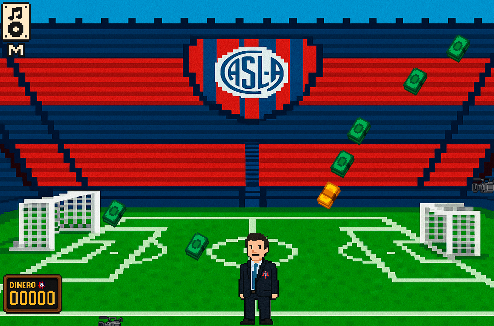

MORETTI GAME 

## Equipo de desarrollo

* Nombres de los integrantes 
* Thiago García 
* Tomás Salgado 
* Dante Sandoval 

## Capturas

## Reglas de Juego / Instrucciones

✅ Los dólares comunes, es decir los verdes, otorgan 1000 puntos   al agarrarlos.

✅ Los dorados, por su parte, otorgan 5000 puntos.

🎯 El objetivo es llegar a los 25.000 dólares, para que tú jugador pueda jugar en la reserva. 

Pero cuidado, ya que como caen billetes, también caen cámaras, lo cual restan 500 puntos a nuestro querido Moretti.

**los controles, son las flechas, para mover a nuestro personaje, hacia arriba, abajo, izquierda y derecha.**
**Con la tecla "M"" podemos mutear la musica de fondo.**
**Con la tecla "N" podemos desmutear la musica de fondo**

## Otros

- Curso/Facultad comision 4 - jueves 
- Versión de wollok: 0.3.1
- Una vez terminado, no tenemos problemas en que el repositorio sea público 

